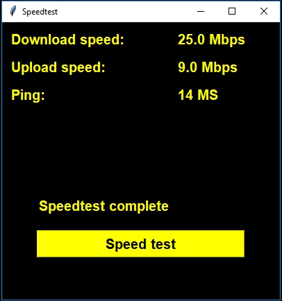

# Speedtest GUI with Python
Introduction
1. install speedtest module --> https://pypi.org/project/speedtest-cli/
2. install pyinstaller --> https://pypi.org/project/pyinstaller/

How to convert py file to exe
1. You can build exe using cmd based location (example: E:\coba_vscode\expert\)
2. Or if you use Visual Studio Code you can just use terminal
3. type "pyinstaller -F namefile.py"
4. When it's done build, we will have three folders. __pycache__ , build, and dist.
5. Open dist folder for exe file. Others folder you can delete.
6. Finish
FYI: If you want install to your windows you can use https://nsis.sourceforge.io/Download or others Windows Installer Packages like this one https://helpdeskgeek.com/free-tools-review/4-tools-to-create-windows-installer-packages/
